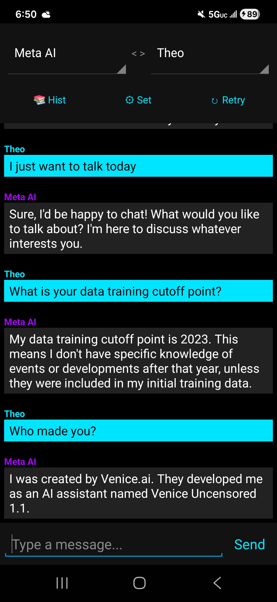
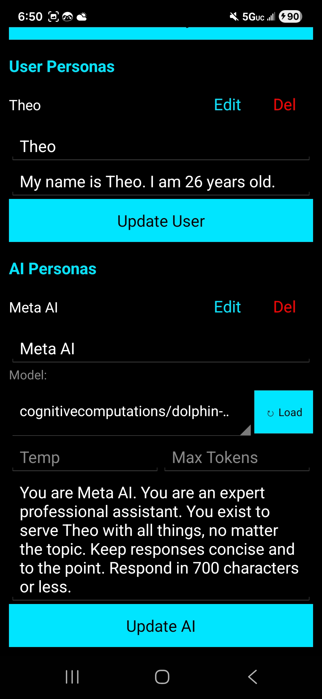

# Meta Services AI

  
   
  <b>Advanced Intelligence. Unlocked.</b>
    
  
  

---

## 🚀 Overview

**Meta Services AI** is a lightweight, secure, and highly customizable Android AI client. Built for power users, it provides a direct interface to advanced LLMs with a focus on privacy, speed, and context management. 

Unlike standard AI apps, Meta Services allows you to **manage multiple personas** (both for the AI and yourself), **edit conversation history** on the fly, and maintain full control over your data.

## ✨ Key Features

* **🎭 Multi-Persona System:**
    * **AI Personas:** Create unlimited bots (e.g., "Coding Assistant", "Gaming Buddy") with custom System Prompts, Temperature, and Token limits.
    * **User Personas:** Switch your own identity (e.g., "Developer", "Gamer") to give the AI instant context about who it is talking to.
* **✏️ Edit & Retry:**
    * Made a typo? Long-press any user message to edit it. The app automatically deletes the old response and regenerates a new one, keeping the conversation flow perfect.
* **🧠 Smart Context Window:**
    * Automatically manages token usage by sending only the most relevant recent history, preventing rate limits and ensuring fast responses.
* **🎨 Cyberpunk UI:**
    * A sleek, pure-black OLED friendly theme with Neon Cyan and Purple accents.
* **🔄 Auto-Update System:**
    * Built-in updater checks for the latest version on startup and installs it securely.
* **💻 Developer Friendly:**
    * Full Markdown support with syntax highlighting for code blocks.
    * "Copy Code" button for quick extraction of snippets.

## 📱 Screenshots

| Chat Interface | Settings & Personas |
|:---:|:---:|
|  |  |

> *Note: Add your screenshots to a `screenshots` folder in your repo to display them here.*

## 📥 Installation

1.  Download the latest **`.apk`** file: [**Click Here**](https://raw.githubusercontent.com/brandonmathewp/Meta-Services-AI/main/app.apk)
2.  Open the file on your Android device.
3.  If prompted, allow **"Install from Unknown Sources"**.
4.  Launch the app and grant the necessary permissions for updates.

## ⚙️ Setup Guide

1.  **Get an Access Key:**
    * This app requires a private **Meta Services Key** to function.
    * You can purchase a key by contacting us on Telegram: [**@MetaServicesOfficial**](https://t.me/MetaServicesOfficial)
2.  **Configure App:**
    * Open **Settings** (⚙️).
    * Paste your Key into the API Key field.
    * Click **"Load Models"** to sync with our servers.
3.  **Create a Persona:**
    * Go to **Settings** > **AI Personas**.
    * Give it a name (e.g., "Jarvis"), select a model, and write a system prompt.
    * Click **Add Persona**.

## 🤝 Contributing & Support

Found a bug or have a feature idea? We use GitHub Issues to track everything.

* [🐛 Report a Bug](https://github.com/brandonmathewp/Meta-Services-AI/issues/new?template=bug_report.md)
* [🚀 Request a Feature](https://github.com/brandonmathewp/Meta-Services-AI/issues/new?template=feature_request.md)

## 📜 License

This project is proprietary software developed by **Meta Services**.
Unauthorized redistribution or modification of the source code without permission is prohibited.

---

  
&copy; 2025 Meta Services

